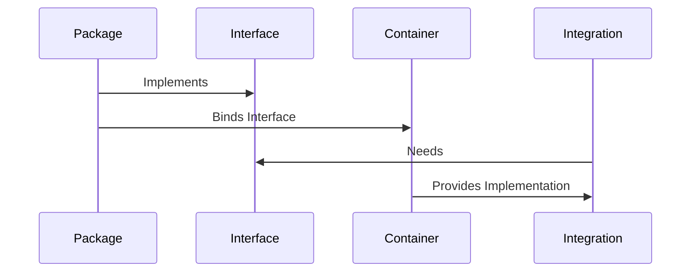
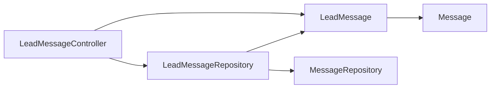
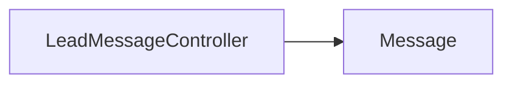

- Author: Cristian Herrera <cristian@lifespikes.com>
- Original Date: 12/06/2022

> :warning: **Code samples for this are being worked on! Please feel free to read and comment as you wish.**

## Tightly coupled central modules at the integration layer
Development of projects that have full implementations of patterns we've been fine-tuning since PRG, like Bolet and Janus Phoenix, have presented a new challenge: Increased difficulty during development when handling modules with high levels of usage across the integration layer.

This RFC covers increasing the tolerance of the integration layer to support more tightly coupled modules in cases in which the layer is heavily reliant on that module.

### Motivation
Janus Phoenix is a great example of the benefits of a decoupled architecture, but also the downsides of it as shown development difficulties on features that involve the leads module _(which is all of them)_.

Unlike every other module, the leads module is central and present in essentially everything within Janus. Enforcing an abstraction layer for lead-related functionalities results in double-work that seems counterintuitive since leads themselves are what "integrate" functionalities into the system, making me doubt its place as a decoupled module.

### Design Detail
The standard design of a decoupled module in JP looks like this (This is without accounting for things like autoloading):



This works great for most modules. It makes the code cleaner, decoupled, testable, and most importantly, rigid. It leaves very little room for error which helps us leave even less room for bugs.

The initial development time, as well as upgrades, is negligible compared to the long-term benefit of this pattern. This may not hold true for what I would like to refer to as "central modules". These are modules that act as central repositories of data for the wider business domain. 

A **Lead** is a good example of this. Each additional module will often end up resulting in an additional relation in the Lead model. With the pattern above, this often results in double repositories, double contracts for resources, and lack of relation/object constraints in the spirit of avoiding improper interface dependence.

Let's assume we have a **Message** module that we want to integrate with leads. Full integration of this might result in this dependency graph:



This might not seem like much until you realize all the de-duplication that has to take place so modules can be integrated through abstraction. Additionally, this is just the dependency graph for the contracts, ignoring the further complexities of the implementation process. It really begins to rear its ugly face when we have to begin thinking about all the different class members that have to be implemented twice.

Instead, I am offering a more traditional approach. While keeping abstractions like the `Message` and `MessageRepository` intact, we would move everything lead-related over to the integration layer as a concrete rather than an abstraction. Essentially, everything **Lead** (_central module_) related, would be built into the integration layer directly.

Through a combination of Eloquent relations, traits, and other ways of keeping our Lead model from becoming large and monolithic, we can get our dependency graph down to this:



Now, yes, if you build your code nicely, the end result might look the same:

```diff
public function store(Lead $lead, CreateLeadMessageRequest $request): Message
{
-    return $lead->messageRepository()->create($request->string('content'));
+    return $lead->messages->create($request->all());
}
```

But, the implementation and actual dev time to get to this point would be much shorter! Best of all, if done properly, we still keep our software decoupled and our concerns mostly separate.

**EDIT 12/10/22 - Tolerance**
Naturally, we can't have every single module out there be treated as a "central module", and a lack of a proper definition could leave room for error when making new modules.

After some experience refactoring a module that now applied this change to the pattern, I noticed that the main factor simply comes down to **data relationships** and **usages**.

If a module is:
  - Central to platform functionality
  - Referenced or likely to be referenced heavily throughout integration code
  - Forms a core component of the wider business domain
  - Features plenty of relationships against multiple models across domains
  - **Sub-modules** of the module **must** also have the above items.

You may consider this a central module.

#### Support graphic: Is it a central module?


### Cost and Alternatives
Continuing to keep central modules decoupled and accessible through abstraction is not impossible, and itself comes with benefits.

One of the issues with tighly coupling central modules is a decrease in the rigidity of our program. Implementation of this change would make integration easier, but would require more "human" strictness from any engineer that works on it. Human error and them leveraging magic can open the door for issues down the road.

Some of these downsides could be offset by enforcing "banned code" rules for code that is too magical, or writing custom PHPStan rules, but overall, it would require discretion from all developers when building into the integration layer.

### Unanswered Questions
- Second, thinking about bi-directional or proxy relations. Modules are decoupled, and cannot depend on each other, but database design sometimes requires this. Proxy models like `LeadMessage` can assist with this problem, but also present their own problems. 
